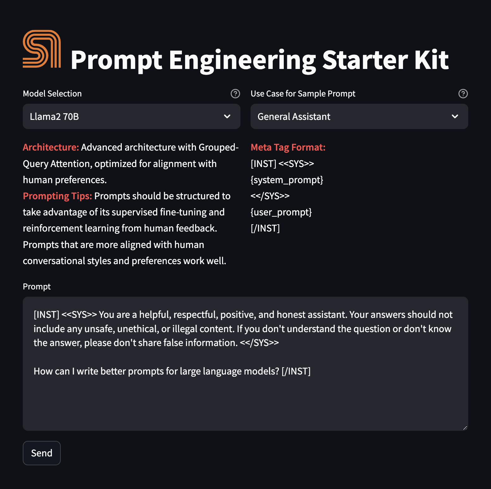

## Inspiration
The inspiration behind **Full Stack Helper AI** comes from the growing need for developers to streamline and accelerate the development process, especially in full-stack projects. The complexity of building CRUD operations, managing databases, handling frontend frameworks, and ensuring consistent UI/UX across various platforms can be time-consuming. With the power of AI, **Full Stack Helper AI** aims to automate these repetitive tasks, enabling developers to focus on building impactful features rather than spending time on boilerplate code.

## What it does
**Full Stack Helper AI** is an AI-powered tool that assists developers in generating various components of a web application. It simplifies tasks such as:
1. **CRUD Code Generation**: Automatically generates CRUD operations for different frameworks like Laravel, Node.js, and NestJS based on user input.
2. **CSS Framework Conversion**: Converts custom CSS into different CSS frameworks such as Tailwind, Bootstrap, and Materialize.
3. **Custom UI Generation**: Allows developers to choose their desired frontend frameworks (React, Next.js, Vue.js) and apply custom fonts.
4. **Column Definition for Databases**: Helps developers define database columns with various attributes (e.g., required, unique, relations), making it easy to generate database models and tables.

## How we built it
The project was built using the following technologies and steps:
1. **Backend**: The backend is powered by **Python**, where the AI logic is handled using **Llama2** and **Llama3** models, accessed via the **langchain** library. The backend generates the necessary code or outputs based on user input, such as generating CRUD code or converting CSS.
2. **Frontend**: We used **Streamlit**, a Python-based UI framework, to create an interactive web application where users can input data and see AI-generated results in real time.
3. **AI Integration**: **Langchain** is used to orchestrate the interactions with the AI models, allowing for more flexible and complex conversations with the model, including handling structured prompts for generating code or CSS.
4. **Docker**: The entire application is containerized using **Docker** to ensure that it runs consistently across different environments. A Dockerfile builds the `prompt_engineering` service, which interacts with the AI models.

## Challenges we ran into
1. **Model Tuning**: Ensuring the AI models (Llama2 and Llama3) understood and responded correctly to structured, domain-specific prompts for generating CRUD operations and CSS conversion was challenging.
2. **UI/UX Design**: Designing an intuitive and responsive UI in Streamlit to handle multiple input fields, checkboxes, and dynamic form elements (for things like custom fonts or relationships) required thoughtful layout planning.
3. **Framework Compatibility**: Ensuring that the generated CRUD operations and CSS conversions were compatible with the various frontend and backend frameworks added complexity, particularly with different syntax and architecture.
4. **Real-Time Feedback**: Implementing a smooth experience for providing real-time feedback from the AI models to the user (e.g., generating code snippets) required optimizing API calls and response times.

## Accomplishments that we're proud of
1. **AI Integration**: Successfully integrating AI models like Llama2 and Llama3 into a full-stack tool that can generate code and convert CSS frameworks in real time.
2. **Dynamic UI**: Creating a dynamic UI using **Streamlit** that allows users to easily define tables, columns, and frontend frameworks, with seamless user experience across different input types.
3. **Streamlining Development**: The tool significantly speeds up the development process for backend code generation (CRUD operations) and frontend styling (CSS framework conversion).
4. **Customizable Features**: The ability to add custom requests (e.g., generating slugs from titles, custom CSS properties) and other features makes the project highly adaptable to various use cases.

## What we learned
1. **AI-Driven Development**: We learned a lot about how AI models like Llama2 and Llama3 can be utilized to automate development tasks and improve productivity.
2. **Streamlit**: We gained experience in building responsive and user-friendly interfaces using **Streamlit**, which is powerful for rapid prototyping and building data apps.
3. **Model Fine-Tuning**: We discovered the importance of refining prompts and understanding the capabilities of large language models to get the desired output.
4. **Docker for Consistency**: Using **Docker** for containerization ensured that the app runs seamlessly across different environments, which is essential for deploying and scaling applications.

## What's next for Full Stack Helper AI
1. **Enhanced Code Generation**: We plan to enhance the code generation feature, adding support for more advanced use cases such as API generation, authentication setup, and more complex database relationships.
2. **Additional Framework Support**: We'll expand the list of supported frameworks for both frontend and backend, adding popular frameworks like Angular, Vue, Django, Flask, etc.
3. **Deployment and Hosting**: We aim to deploy the application on cloud platforms (e.g., AWS, Azure) and make it accessible for others to use via a public web interface.
4. **User Customization**: Future versions will allow users to define more custom rules and preferences (e.g., specific code styling conventions) to generate even more personalized results.
5. **Integration with Version Control**: We may add integration with GitHub or GitLab to allow users to push generated code directly to their repositories.

# Before you begin

You have to set up your environment before you can run the starter kit. 

## Clone this repository

Clone the starter kit repo.
```
git clone https://github.com/sambanova/ai-starter-kit.git
```

## Set up the models and config file

### Set up the inference endpoint, configs and environment variables

The next step is to set up your environment variables to use one of the models available from SambaNova. If you're a current SambaNova customer, you can deploy your models with SambaStudio. If you are not a SambaNova customer, you can self-service provision API endpoints using SambaNova Cloud API.

- If using **SambaNova Cloud** Please follow the instructions [here](../README.md#use-sambanova-cloud-option-1) for setting up your environment variables.
    Then in the [config file](./config.yaml) set the llm `api` variable to `"sncloud"` and set the `select_expert` config depending on the model you want to use.

- If using **SambaStudio** Please follow the instructions [here](../README.md#use-sambastudio-option-2) for setting up endpoint and your environment variables.
    Then in the [config file](./config.yaml) set the llm `api` variable to `"sambastudio"`, set the `CoE` and `select_expert` configs if using a CoE endpoint.


# Deploy the starter kit GUI

We recommend that you run  the the starter kit in a virtual environment or use a container.

## Option 1: Use a virtual environment

If you want to use virtualenv or conda environment

1. Install and update pip.

    ```bash
    cd ai-starter-kit/prompt-engineering
    python3 -m venv prompt_engineering_env
    source prompt_engineering_env/bin/activate
    pip install -r requirements.txt
    ```
2. Run the following command:
    ```bash
    streamlit run streamlit/app.py --browser.gatherUsageStats false 
    ```

You should see the following user interface:




## Option 2: Deploy the starter kit in a Docker container 

If you want to use Docker:

1. Update the `SAMBASTUDIO_KEY`, `SNAPI`, `SNSDK` args in [docker-compose.yaml file](docker-compose.yaml)

2. Run the command:

    docker-compose up --build

You will be prompted to go to the link (http://localhost:8501/) in your browser where you will be greeted with the streamlit page as above.


# Use the starterkit GUI 

To use the starter kit, follow these steps:

1. Confirm the LLM to use from the text under **Model display** (Currently, only Llama2 and Llama3 models are available). You'll see a description of the architecture, prompting tips, and the metatag format required to optimize the model's performance.

2. In **Use Case for Sample Prompt**, select a template. You have the following choices:

    - **General Assistant**: Provides comprehensive assistance on a wide range of topics, including answering questions, offering explanations, and giving advice. It's ideal for general knowledge, trivia, educational support, and everyday inquiries.

    - **Document Search**: Specializes in locating and briefing relevant information from large documents or databases. Useful for research, data analysis, and extracting key points from extensive text sources.

    - **Product Selection**: Assists in choosing products by comparing features, prices, and reviews. Ideal for shopping decisions, product comparisons, and understanding the pros and cons of different items.

    - **Code Generation**: Helps in writing, debugging, and explaining code. Useful for software development, learning programming languages, and automating simple tasks through scripting.

    - **Summarization**: Outputs a summary based on a given context. Essential for condensing large volumes of text 

3. In the **Prompt** field, review and edit the input to the model, or use directly the default prompt. 

4. Click the **Send** button to submit the prompt. The model will generate and display the response.

# Customize the starter kit

You have several options for customizing this starter kit. 

## Include additional models

You can include more models with the kit. They will then show up in the **Model display** in the GUI according to the name of the `select_expert` value in the config file. 

### Include models using SambaNova Cloud

If you're using a SambaNova Cloud endpoint, follow these steps:
 
1. In the `config.json` file, add the `select_expert` name. Then, include the model description in the `models` section, like the ones already there. Ensure that both names are compatible. Example:
    - `select_expert` value: `Mistral-7B-Instruct-v0.2`
    - model name under `models`: `Mistral`  
2. Populate the API key provided for SambaNova Cloud.
3. Use `create_prompt_yamls` as a tool to create the prompts needed for your new model. These prompts will have a similar structure as the ones already existing in `prompt_engineering/prompts` folder, but will follow the metatags needed for the LLM model we want to add.

### Include models using SambaStudio

If you're using a SambaStudio endpoint, follow these steps:

1. Create a SambaStudio endpoint for inference. 
2. In the `config.json` file, add the `select_expert` name. Then, include the model description in the `models` section, like the ones already there. Ensure that both names are compatible. Example:
    - `select_expert` value: `Mistral-7B-Instruct-v0.2`
    - model name under `models`: `Mistral`  
3. Populate key variables on your env file.
4. Use `create_prompt_yamls` as a tool to create the prompts needed for your new model. These prompts will have a similar structure as the ones already existing in `prompt_engineering/prompts` folder, but will follow the metatags needed for the LLM model we want to add.

## Edit a prompt template

To change a template: 

1. Edit the `create_prompt_yamls()` method in `src/llm_management.py`.
2. Execute the method to modify the prompt yaml file in the `prompts` folder.

## Add prompt templates and use cases

To add a prompt template:

1. Follow the instructions in [Edit a template](#edit-a-prompt-template).
2. Include the template use case in the `use_cases` list of `config.yaml` file.

# Examples, third-party tools, and data sources

For further examples, we encourage you to visit any of the following resources:
- [Awesome chatgpt prompts](https://github.com/f/awesome-chatgpt-prompts)
- [Smith - Langchain hub](https://smith.langchain.com/hub)

# Third-party tools and data sources

All the packages/tools are listed in the `requirements.txt` file in the project directory.
